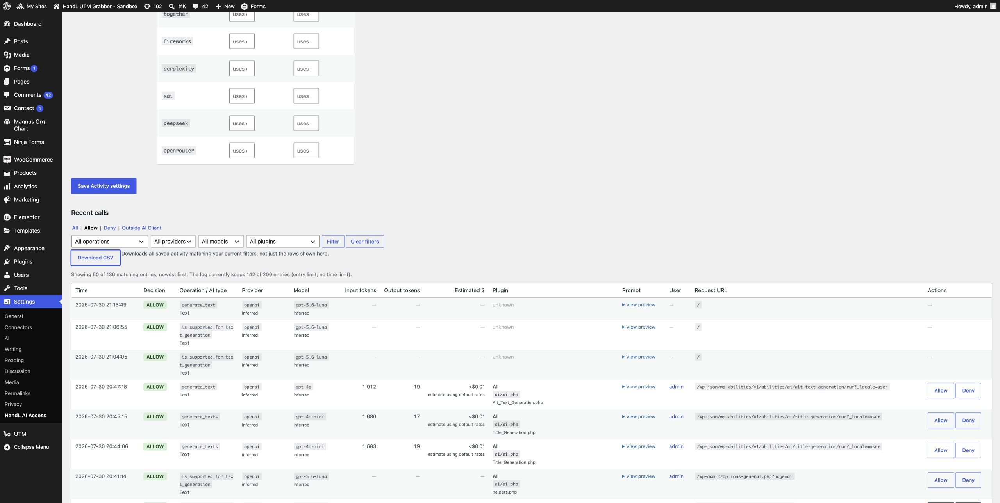

# PR #72 QA recheck evidence

Commit under test: `6bad8dbddf0f86dcce22f72f104dc354141429ac`.

## Acceptance coverage

- **UI + approved helper:** the screenshot shows **Download CSV** and
  `Downloads all saved activity matching your current filters, not just the
  rows shown here.`
- **Current filters + no 50-row cap:** with the **Allow** filter active, the
  UI reports **50 of 136 matching entries**. The actual downloaded CSV had
  **136** records, all `allow`.
- **CSV structure:** the download is CSV text beginning with the expected
  `Time,Decision,...` header. PHP `fgetcsv` parsed all 136 records with zero
  malformed-width rows and no `Actions` column.
- **Authorization boundary:** an unauthenticated POST to `export_log`
  redirected to the WordPress login page, not a CSV response.
- **Regression coverage:** complete PHPUnit passed: 152 tests, 625 assertions.

The download was created from the sandbox browser session and then parsed
locally without publishing audit-log content.
