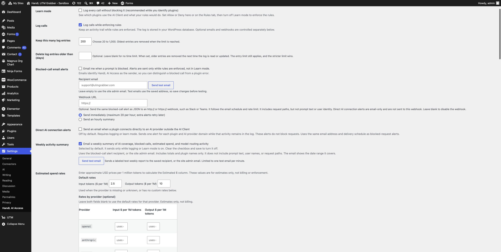

# PR #73 QA evidence

Commit under test: `da44343e2dca8bee15f885bd99c04fa5eff915e7`.

## Acceptance coverage

- **Default off + plain-language UI:** screenshot shows the unchecked **Direct
  AI connection alerts** control and its Activity-tab helper. It also shows
  the email-only webhook clarification.
- **Immediate alert:** a real `Shadow_AI` direct-HTTP observation to a known
  provider delivered one message to local MailHog at
  `haktan+aicac56-detector@handldigital.com`. The message subject identifies a
  direct AI connection and its body says `Status: Observed, not blocked`.
- **Duplicate collapse:** two observations for one plugin/provider pair kept
  one retained row with call count 2 and delivered one immediate email.
- **Digest:** one shadow observation queued, then the manual digest flush sent
  a direct-AI-connection summary. Its body included the direct-connection
  header and `Status: Observed, not blocked`, with no blocked-call section.
- **Toggle off:** a new observed direct connection produced neither MailHog
  mail nor a digest queue item.
- **Webhook exclusion:** a runtime `pre_http_request` observer saw zero
  outbound webhook requests for immediate and digest shadow-only cases.

The local QA fixture used only plus-addressed MailHog recipients and restored
the original WordPress policy, audit log, digest queue, and rate options after
the run. Full PHPUnit: 152 tests, 618 assertions passed.
