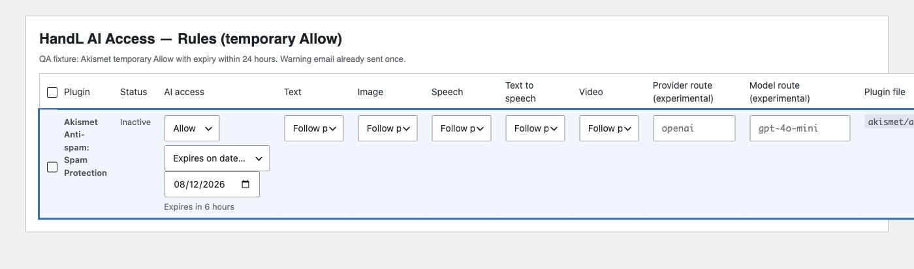
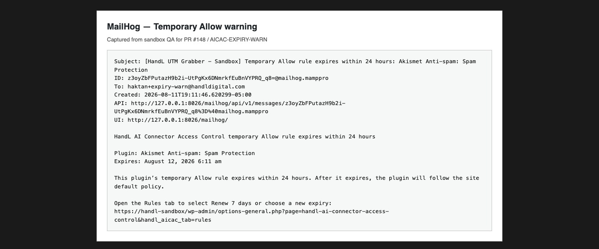
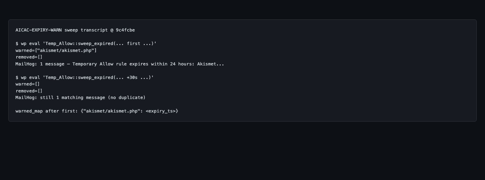

## QA evidence (9c4fcbe)

PR #148 / issue #142 — Temporary Allow expiry warning (24h window, idempotent sweep, Krusty-approved mail copy).

Sandbox: `handl-sandbox` plugin at `9c4fcbe`. Fixture: `akismet/akismet.php` → Allow, expiry ~6h, `alert_on_deny` on, recipient `haktan+expiry-warn@handldigital.com`.

### 1. Rules — Temporary Allow state with expiry / renew
Akismet row: Allow · Temporary allow · Expires in 6 hours · Renew presets (24h / 7d / 30d).

### 2. MailHog — expiry warning email
Subject/body match Krusty-approved Temporary Allow wording (24 hours / site default policy / Renew 7 days). Recipient `haktan+expiry-warn@handldigital.com`.

### 3. Sweep transcript — first warned, second empty
First sweep: `warned=["akismet/akismet.php"]`. Second sweep (+30s): `warned=[]` (no duplicate mail).

See also `SWEEP_TRANSCRIPT.md` and `MAILHOG_CAPTURE.txt`.

AC map:
- Rules UI shows Temporary Allow + remaining time + renew actions
- First sweep within 24h window emails once and records warned path
- Second sweep does not re-mail (empty warned list)
- Mail copy: heading, explanation, Renew 7 days guidance, approved recipient
